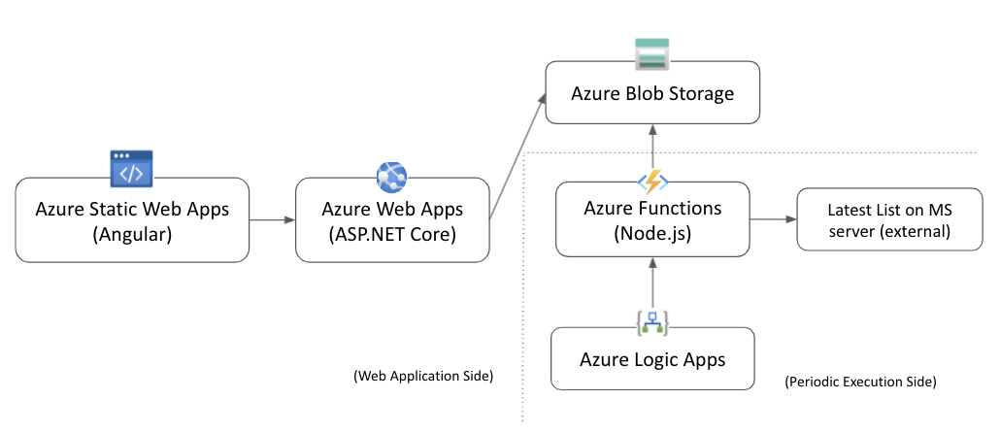

## IEToEdgeListView
- The Web Site allows you to check visually Microsoft Edge compatibility list on MS Server.
- This repo is the Client-side application.
- URL : https://happy-wave-05f6e180f.azurestaticapps.net/ (Azure Static Web Apps)

## Environment
### Production
- Frontend : Angular app on Azure Static Web Apps
- Backend : ASP.NET Core Web API on Azure App Service
- Storage : Azure Blob Storage
- Periodic Execution : Azure Functions (Node.js) + Azure Logic Apps

## ToDo
TBD
